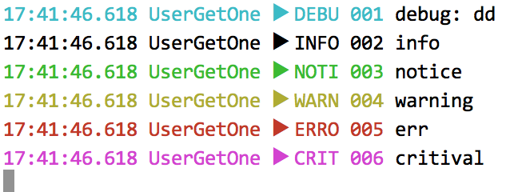

# 北极光电影购票系统服务端

## 整体架构

## logger使用指南

使用了log库：https://github.com/op/go-logging

logger定义于：`src/log/logInit.go`

使用方法：

1. 引入：`import . "../log"`

2. 使用`Log.xxx("str")`，有六个等级：

   ```go
   	Log.Debugf("debug: %v", userId)
   	Log.Info("info")
   	Log.Notice("notice")
       Log.Warning("warning")
       Log.Error("err")
       Log.Critical("critival")
   ```

   输出：

   

存在问题：重新启动程序后，将字符串写入log.txt文件时，是从文件开头开始写，导致重新修改了文件头的内容，而文件尾的内容不变。

test